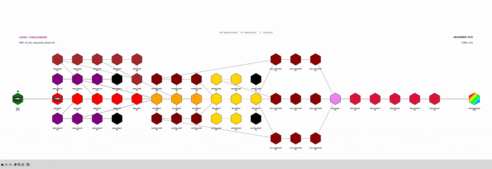
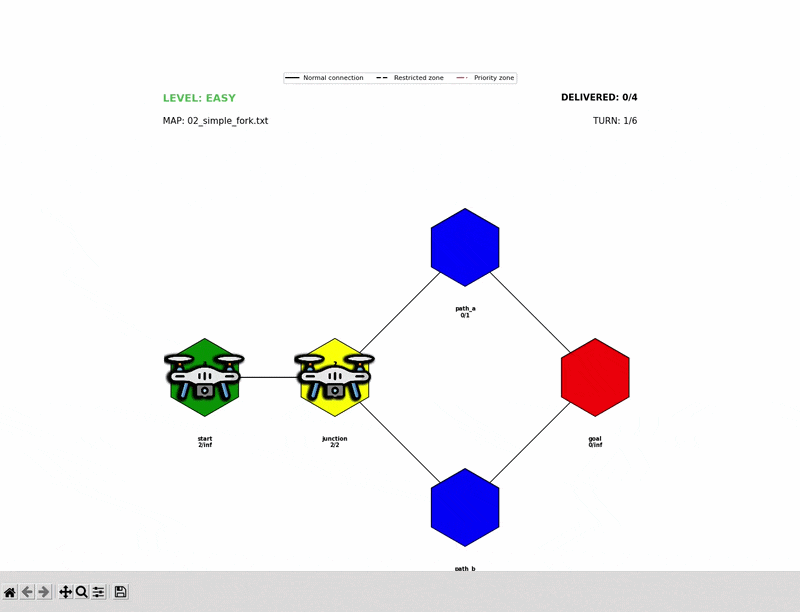

*This project has been created as part of the 42 curriculum by bmelikse.*

# 🛰️ Fly-in

Multi-drone pathfinding and scheduling on a zone graph - with a live matplotlib
visualization of the whole simulation in flight.

<p align="center">
  
</p>

---

## Table of Contents

- [Description](#description)
- [Instructions](#instructions)
- [Installation](#installation)
- [Map file format](#map-file-format)
- [Example](#example)
- [Algorithm](#algorithm)
- [Visual representation](#visual-representation)
- [Error handling](#error-handling)
- [Resources](#resources)

---

## Description

**Fly-in** simulates a fleet of delivery drones moving through a network of
zones (hubs) toward a shared destination, under real constraints: limited
capacity per zone, limited capacity per connection, restricted zones that cost
extra time to cross, and a shared graph that every drone competes for at once.

The goal is to deliver every drone from the map's `start_hub` to its `end_hub`
in as few simulation turns as possible, while respecting every constraint —
no graph library is used anywhere in the project; the parser, the pathfinder,
and the scheduler are all built from scratch.

The project is split into two independent, fully object-oriented modules that
share the same core logic:

- a **terminal/log output** that prints the exact turn-by-turn move format the
  subject requires, suitable for piping and diffing;
- a **graphical visualization** built with `matplotlib`, animating every
  drone's movement across the zone graph turn by turn.


## Results

| Difficulty | Map | Drones | Subject target | My result |
|---|---|---:|---:|---:|
| Easy | Linear path | 2 | ≤ 6 turns | **4 turns** |
| Easy | Simple fork | 4 | ≤ 8 turns | **6 turns** |
| Easy | Basic capacity | 4 | ≤ 6 turns | **6 turns** |
| Medium | Dead end trap | 5 | ≤ 12 turns | **8 turns** |
| Medium | Circular loop | 6 | ≤ 15 turns | **15 turns** |
| Medium | Priority puzzle | 5 | ≤ 12 turns | **8 turns** |
| Hard | Maze nightmare | 8 | ≤ 30 turns | **13 turns** |
| Hard | Capacity hell | 12 | ≤ 35 turns | **16 turns** |
| Hard | Ultimate challenge | 15 | ≤ 45 turns | **26 turns** |
| Challenger | The Impossible Dream | 25 | **< 45 turns** | **43 turns** |

### Difficulty averages

| Difficulty | Subject target | My average |
|---|---:|---:|
| Easy | < 10 turns | **5.3 turns** |
| Medium | 10-30 turns | **10.3 turns** |
| Hard | < 60 turns | **18.3 turns** |

### Bonus

| Bonus requirement | Subject target | My result |
|---|---|---:|
| Exceptional Performance - Easy maps | Meet all reference targets | **3 / 3** |
| Exceptional Performance - Medium maps | Meet all reference targets | **3 / 3** |
| Exceptional Performance - Hard maps | Meet all reference targets | **3 / 3** |
| Challenger - The Impossible Dream | Beat 45 turns | **43 turns** |

## Instructions

### Requirements

- Python 3.10+
- `matplotlib`, `numpy`

### Installation


<!-- git clone <your_repo_url>
cd fly-in -->
```bash
make install
```

### Running

Two separate entry points, for the two separate mandatory deliverables:

```bash
# Plain terminal output only - pipeable, diffable, no interaction.
make run CONFIG=maps/easy/01_simple_linear_path.txt

# Interactive menu: pick a difficulty, pick a map, see the terminal output,
# then optionally launch the animated visualization.
make menu
```

Other Makefile targets:

| Target | Effect |
| --- | --- |
| `make run CONFIG=<path>` | Run the plain simulation on a given map |
| `make menu` | Launch the interactive difficulty → map → visualization menu |
| `make install` | Install dependencies |
| `make debug` | Run under `pdb` |
| `make lint` | `flake8` + `mypy` (relaxed) |
| `make lint-strict` | `flake8` + `mypy --strict` |
| `make clean` | Remove `__pycache__`, `.mypy_cache`, `.pyc` files |

## Map file format

```text
# Easy Level 1: Simple linear path
nb_drones: 10

start_hub: start 0 0 [color=green]
hub: waypoint1 1 0 [zone=restricted color=blue]
hub: waypoint2 2 0 [color=blue]
end_hub: goal 3 0 [color=red]

connection: start-waypoint1 [max_link_capacity=4]
connection: waypoint1-waypoint2
connection: waypoint2-goal
```

- `#` starts a comment line.
- `nb_drones` sets the fleet size.
- Each zone line gives a name and `x y` coordinates, plus optional metadata
  in `[key=value ...]` — `zone` (`normal` / `restricted` / `priority` / `blocked`),
  `max_drones`, `color`.
- Each `connection` line links two zones by name, with an optional
  `max_link_capacity`.

## Example

Running the map above:

```
$ make run CONFIG=maps/easy/01_simple_linear_path.txt
D1-start-waypoint1
D1-waypoint1
D1-waypoint2 D2-start-waypoint1
D2-waypoint1 D1-goal
D2-waypoint2 D3-start-waypoint1
...
D10-waypoint2
D10-goal
Total turns: 22
```

Each space-separated token is one drone's move for that turn, in
`D<id>-<zone>` format (or `D<id>-<zoneA>-<zoneB>` while mid-transit across a
connection).

## Algorithm

### Parsing

`parser.py` reads each map file line by line into `Zone`, `Connection`, and `Map` objects, validating structure and metadata as it goes.

### Pathfinding

`pathfinding.py` implements Dijkstra's algorithm from scratch through `find_shortest_path`, calculating a baseline shortest route from `start_hub` to `end_hub`.

### Diverse routing

`assign_diverse_paths` reruns Dijkstra for each drone with a small congestion penalty added to the cost of already-used edges. This encourages drones to spread across alternative routes instead of all queueing on the same globally shortest path.

### Scheduling

`simulation.py`'s `simulate_all_drones` advances every drone simultaneously, turn by turn.

Departures free up connection and zone capacity before arrivals for the same turn are evaluated. When multiple drones contend for the same limited capacity, the drone that has been waiting longest gets priority.

Drones keep their precomputed path and wait when blocked rather than rerouting mid-flight.

On the 25-drone challenger map, this scheduler consistently completes in **43 turns**, under the 45-turn bonus target.

---

## Visual representation

`visualization.py` renders the full simulation as a `matplotlib` animation:

- every zone is drawn as a hexagon, colored by its type, sized relative to
  the actual spacing between connected zones so it scales correctly on maps
  of any density;
- zones with `color=rainbow` get an animated flowing HSV gradient instead of
  a flat fill;
- connections are styled by both capacity (line thickness) and zone type
  (dashed for restricted, dash-dot for priority);
- each drone is an animated icon with a numbered label, repositioned every
  frame from the simulation's move history;
- every zone label shows a live `current/max` occupancy count;
- a HUD shows the level, map name, delivered count, and current turn,
  anchored to stay fixed on screen regardless of map size;
- a legend above the map explains the zone/connection styling.

<p align="center">
  
</p>

## Error handling

Malformed map files never crash with a raw traceback. `parser.py` validates
as it parses and raises a single custom `MapParseError` naming the offending
line and the reason — missing `start_hub`/`end_hub`, unknown zone referenced
by a connection, duplicate zone names, invalid zone types, non-positive
capacities, and malformed `key=value` metadata are all caught this way. Both
`main.py` and `menu.py` catch `MapParseError` and print a single clean
`Error: line X: ...` message instead of failing.

The interactive menu (`menu.py`) also validates every input: an out-of-range
or non-numeric selection re-prompts instead of crashing, and `q` is always
available to quit cleanly from the difficulty and map-selection prompts.

---

## Resources

### Books

* [Grokking Algorithms — Aditya Y. Bhargava](https://www.manning.com/books/grokking-algorithms) — used as a reference for algorithms and especially graph algorithms such as Dijkstra's algorithm.

### Documentation

* [Python Documentation](https://docs.python.org/3/)
* [Python Tutorial](https://docs.python.org/3.10/tutorial/) — Python language and programming reference.
* [Matplotlib Animation API](https://matplotlib.org/stable/api/animation_api.html) — reference for `FuncAnimation` and animation handling.
* [Matplotlib Animation Examples](https://matplotlib.org/stable/gallery/animation/index.html)
* [Matplotlib `RegularPolygon`](https://matplotlib.org/stable/api/_as_gen/matplotlib.patches.RegularPolygon.html)

### Algorithms

* [Dijkstra's algorithm — Wikipedia](https://en.wikipedia.org/wiki/Dijkstra%27s_algorithm)
* [Dijkstra's algorithm in 3 minutes — YouTube](https://www.youtube.com/watch?v=_lHSawdgXpI)
* [YouTube — Algorithm / graph reference](https://www.youtube.com/watch?v=EFg3u_E6eHU&t=217s)
* [YouTube — Algorithm / graph reference](https://www.youtube.com/watch?v=bZkzH5x0SKU&t=74s)


## AI usage

AI tools were used as development and debugging assistants during the project.

**Claude** and **Google Gemini** were used for:

* debugging Python and Matplotlib issues;
* reviewing and explaining new concepts;
* investigating runtime and specific rendering problems;
* understanding library documentation and API behavior;
* reviewing error-handling approaches;
* discussing project structure and implementation ideas.
* helping to polish the README

AI was **not used to generate the core pathfinding or scheduling algorithms from scratch**. The pathfinding, scheduling, parsing logic, and their final implementation were designed and implemented by the author.

The final code was reviewed, tested, and adapted manually to fit the project requirements and constraints.
